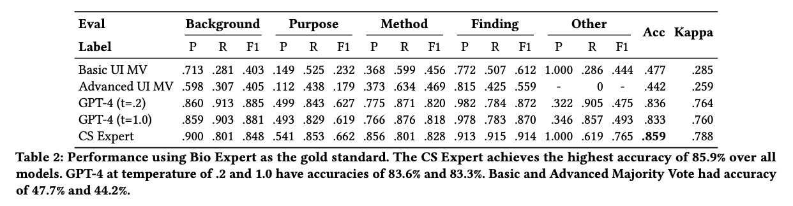

# If in A Crowdsourced Data Annotation Pipeline, A GPT-4 Dataset

# Dataset Overview

This is the Github repo of [If in a Crowdsourced Data Annotation Pipeline, A GPT-4](https://dl.acm.org/doi/10.1145/3613904.3642834) Dataset.

The annotated dataset that denotes the **Background, Purpose, Method, Finding/Contribution, and Other** for **200** English abstracts in the [COVID-19 Open Research Dataset](https://www.semanticscholar.org/cord19) after 2022 and before July 2023.

The dataset contains annotation from crowd workers from [Amazon Mechanical Turk](https://www.mturk.com/), [OpenAI](https://openai.com/) GPT-4 zero shot at different temperatures, a Computer Science Expert, and a Biomedical Expert.

For worker recruiment and grouping, we set up 800 qualification Human Intelligence Task (HIT) on MTurk with the basic interface. Of those who passed, we divided 800 workers into two groups: 400 for the basic and 400 for the advanced interface. Workers could only access the HITs of their qualified group.

For worker annotation, 200 abstracts were divided into four batches of 50, posting one at a time. For each abstract, we created two HITs: one with the basic interface and the other with the advanced interface. We recruited 20 workers via 20 assignments for each HIT.

For GPT-4 labels, we used the full worker instruction from the original CODA-19 dataset as GPT-4’s prompt for our data labeling. We tested GPT-4 using both high (1.0) and low (0.2) temperature settings. For each setting, we executed the model five times for every sentence segment. The final GPT-4 labels in our dataset were determined by majority voting from these five executions.

For both experts labels, they manually annotated the entire test set of 200 abstracts from our MTurk study using the advanced interface.

For more details, please check our [paper](https://dl.acm.org/doi/10.1145/3613904.3642834). **If you have any question, please contact Steven at (zeyuhe@psu.edu)**

## Table of Contents

- [Annotated Data](#annotated-data)
- [Worker List](#worker-list)
- [How to Replicate Results?](#how-to-replicate-results)
- [Data Quality](#data-quality)
- [How Much Did it Cost?](#how-much-did-it-cost)
- [How to Cite?](#how-to-cite)
- [Acknowledgments](#acknowledgments)
- [Miscellaneous](#miscellaneous)

## Annotated Data

All annotated data and the corresponding annotated scientific article abstract sentence segments are stored in the 'data/annotated-label' folder.
This folder contains four batch files, numbered from 1 to 4, representing the sequence in which the batches were released for annotation.
Each batch folder contains files that store the original abstracts and their annotated sentences. Each file includes the following fields: paper_id, cord_id (from CORD-19), and sentence_segment, which contains the original segment and its corresponding labels from various sources, including basic worker, advanced worker, GPT-4 at temperatures 0.2 and 1.0, cs-expert, and bio-expert.

### Footnote:

- `basic worker`: Labels from the basic worker interface.
- `advanced worker`: Labels from the advanced worker interface.
- `gpt-t0.2` and `gpt-t1.0`: Labels generated by zero-shot GPT-4 at temperatures 0.2 and 1.0, respectively.
- `cs-expert`: Labels provided by the first author.
- `bio-expert`: Labels provided by Dr. Ding, serving as the gold standard in our paper.

### Folder structure

```
data
├── annotated-data                                  # Annotated data folder
│   ├── batch-1                                     # Batch 1 of annotated data
│   ├── batch-2                                     # Batch 2 of annotated data
│   ├── batch-3                                     # Batch 3 of annotated data
│   └── batch-4                                     # Batch 4 of annotated data
├── worker                                          # Worker data folder
│   ├── all-worker                                  # All worker data
│   └── underperforming-worker                      # Underperforming worker data
```

### Data JSON Schema

```
{
    "paper_id": the paper ID,
    "cord_uid": the paper ID in CORD-19,
    "sentence_segment": {
        "1": { #segment id
            "segment": the tokenized text of the sentence segment 1 in the paper abstract,
            "label": {
                "basic": {
                    the label from one worker using the basic worker interface,
                    ...
                },
                "advanced": {
                    the label from one worker using the advance worker interface,
                    ...
                },"gpt-4": {
                    "gpt-t1.0": the label from zero shot GPT-4 at temperature 1.0,
                    "gpt-t0.2": the label from zero shot GPT-4 at temperature 0.2
                },
                "cs-expert": the label from the first author,
                "bio-expert": the label from the bio expert,
            }
        },
        "2": {
            ...
        }...
    }
}
```

## Worker List

### All Workers

All worker IDs are stored under 'data/worker/all-worker'. This folder contains two files, 'advanced-worker.json' and 'basic-worker.json', which represent workers from using the advanced worker interface and the basic interface. We have 199 advanced workers and 216 basic workers. Advanced worker ID starts with 'A' and basic worker ID starts with 'B'.

### Worker JSON Schema

```
[
    Worker_ID_1,
    Worker_ID_2,
    ...
]
```

### Underperforming Workers

**Identify Underperforming Worker**

For each batch, we manually labeled only 10 abstract. We then used these labels to compute three worker quality control statistics:

1. label accuracy, based on only 10 manually labeled abstracts per batch.
1. probability of agreeing with the majority label.
1. probability of labeling “Other,” a rare label.

We manually reviewed the bottom 30 worker's labels based on (1) and (2) and top 30 from (3). If we observed a worker consistently providing incorrect labels or seemingly spamming our task, we revoked their qualification.

All underperforming worker IDs are stored under 'data/worker/underperforming-worker'. This folder contains two files, 'advanced-under-worker.json' and 'basic-under-worker.json', which represent workers from using the advanced worker interface and the basic interface. In each file, underperforming workers are categorized by batch, indicating the batch in which they were identified.

### Underperforming Worker JSON Schema

```
{
    "1": [
        Worker_ID_1,
        Worker_ID_2,
        ...
    ],
    ...
    "4": [
        ...
    ]
}
```

## How to Replicate Results?

### Data Cleaning Strategy

Based on the underperforming workers identified in each batch, we came up with three cleaning strategies.

1. All: Retain every collected label without any exclusions.
2. Exclude-By-Worker: Exclude labels from any MTurk worker who was ever removed.
3. Exclude-By-Batch: Only exclude a label if its annotator was removed during that specific data batch. This means if a worker was removed from a given batch, we only exclude their labels from that batch but retain those from prior batches.

### Aggregation Algorithm

We tested on eight label-aggregation algorithms.

- Majority Vote
- Dawid-Skene
- One-coin Dawid-Skene
- GLAD (Generative model of Labels, Abilities, and Difficulties)
- M-MSR (Matrix Mean-Subsequence-Reduced Algorithm)
- MACE (Multi-Annotator Competence Estimation)
- Worker Agreement with Aggregate (Wawa)
- Zero-Based Skill (ZBS)

### Worker Label Replication

We implemented all the algorithms using [Crowd-Kit](https://github.com/Toloka/crowd-kit), except for Majority Voting and MACE.

#### Majority Vote

The Majority Vote method uses a tie-breaker approach, prioritizing labels in the following order: Finding, Method, Purpose, Background, and Other.

#### MACE

We selected the [MACE implementation by Hovy et al.](https://github.com/dirkhovy/MACE) due to its extensive use and high speed.

#### Other Aggregation Algorithms

For algorithms of Dawid-Skene, One-Coin Dawid-Skene, M-MSR, GLAD, Wawa, and ZBS provided by Crowd-Kit, we adhered to the default parameters specified by Crowd-Kit.

Note:

- M-MSR occasionally encountered failures when the number of crowd workers was less than 10. We chose to ignore these failures in our simulation phase.
- In our experiment, the results from the GLAD and MACE aggregation algorithms sometimes varied within 0.01 accuracy. This variation is due to the inherent randomness in the convergence processes of both algorithms.

## Compile Requirement

The Crowd-kit version used in our experiment was '1.2.1'.

```
pip install crowd-kit==1.2.1
```

## Data Quality

We worked with a biomedical expert and computer science expert to assess label quality. Both experts respectively annotated the same 200 abstracts. The inter-annotator agreement (Cohen's kappa) between two experts is 0.788. We used bio expert's label as the gold standard label. Table 2 presents the accuracies of the majority vote labels from the basic and advanced worker interfaces (all-worker cleaning strategy), GPT-4 at temperatures of 1.0 and 0.2, and the computer science expert.

<p align="center">
  
</p>

For more details, please check our [paper](https://dl.acm.org/doi/10.1145/3613904.3642834).

## How Much Did it Cost?

Annotating one abstract costs $16.94 with 40 workers(advanced and basic UI workers). This cost includes the payment for workers and 40% fee charged by MTurk. The total cost on MTurk was $4,508 ($3,388 for annotation tasks and $1,120 for qualification tasks).

The main experiment with GPT-4 totaled only $122.08.

## How to cite?

```
@inproceedings{10.1145/3613904.3642834,
author = {He, Zeyu and Huang, Chieh-Yang and Ding, Chien-Kuang Cornelia and Rohatgi, Shaurya and Huang, Ting-Hao Kenneth},
title = {If in a Crowdsourced Data Annotation Pipeline, a GPT-4},
year = {2024},
isbn = {9798400703300},
publisher = {Association for Computing Machinery},
address = {New York, NY, USA},
url = {https://doi.org/10.1145/3613904.3642834},
doi = {10.1145/3613904.3642834},
abstract = {Recent studies indicated GPT-4 outperforms online crowd workers in data labeling accuracy, notably workers from Amazon Mechanical Turk (MTurk). However, these studies were criticized for deviating from standard crowdsourcing practices and emphasizing individual workers’ performances over the whole data-annotation process. This paper compared GPT-4 and an ethical and well-executed MTurk pipeline, with 415 workers labeling 3,177 sentence segments from 200 scholarly articles using the CODA-19 scheme. Two worker interfaces yielded 127,080 labels, which were then used to infer the final labels through eight label-aggregation algorithms. Our evaluation showed that despite best practices, MTurk pipeline’s highest accuracy was 81.5%, whereas GPT-4 achieved 83.6%. Interestingly, when combining GPT-4’s labels with crowd labels collected via an advanced worker interface for aggregation, 2 out of the 8 algorithms achieved an even higher accuracy (87.5%, 87.0%). Further analysis suggested that, when the crowd’s and GPT-4’s labeling strengths are complementary, aggregating them could increase labeling accuracy.},
booktitle = {Proceedings of the CHI Conference on Human Factors in Computing Systems},
articleno = {1040},
numpages = {25},
keywords = {Crowdsourcing, Data Annotation, GPT-4, Large Language Model},
location = {Honolulu, HI, USA},
series = {CHI '24}
}
```

## Acknowledgments

We extend our gratitude to Dmitry Ustalov and Nikita Pavlichenko for their valuable feedback and insights on the Crowd-Kit implementations. Our thanks also go to Xingwei He and Jian Jiao for clarifying details about the QK dataset mentioned in their research. We are grateful to Man Luo for detailing the data-labeling process in her publications. Additionally, we appreciate the contributions of the crowd workers on Amazon Mechanical Turk who participated in our studies.

## Miscellaneous

- We presented summary of our work at [Workshop (LLMs as Research Tools:
  Applications and Evaluations in HCI Data Work) @ CHI 2024](https://sites.google.com/view/llmsindatawork/schedule), May 12th, 2024.
- We presented our work at [CHI 2024](https://programs.sigchi.org/chi/2024/program/content/148078), May 14th, 2024.
- [IST research showcased at top human-computer interaction conference](https://www.psu.edu/news/information-sciences-and-technology/story/ist-research-showcased-top-human-computer-interaction/?fbclid=IwZXh0bgNhZW0CMTEAAR0DxeHnFTTrwxHk5dXFqztZNgX0QrZrxl3F05Q8s1Dc09k9l14qUqqK2kc_aem_AcoW77OOz4MTeSjjWWI7N0CFCr8ZUsz-esK2MLHC9VUh7VPH2KDfqAyGI8TXVY0RKm1qTitZdAW6OjKCrkzn9vNF), June 13th, 2024. PSU News.
